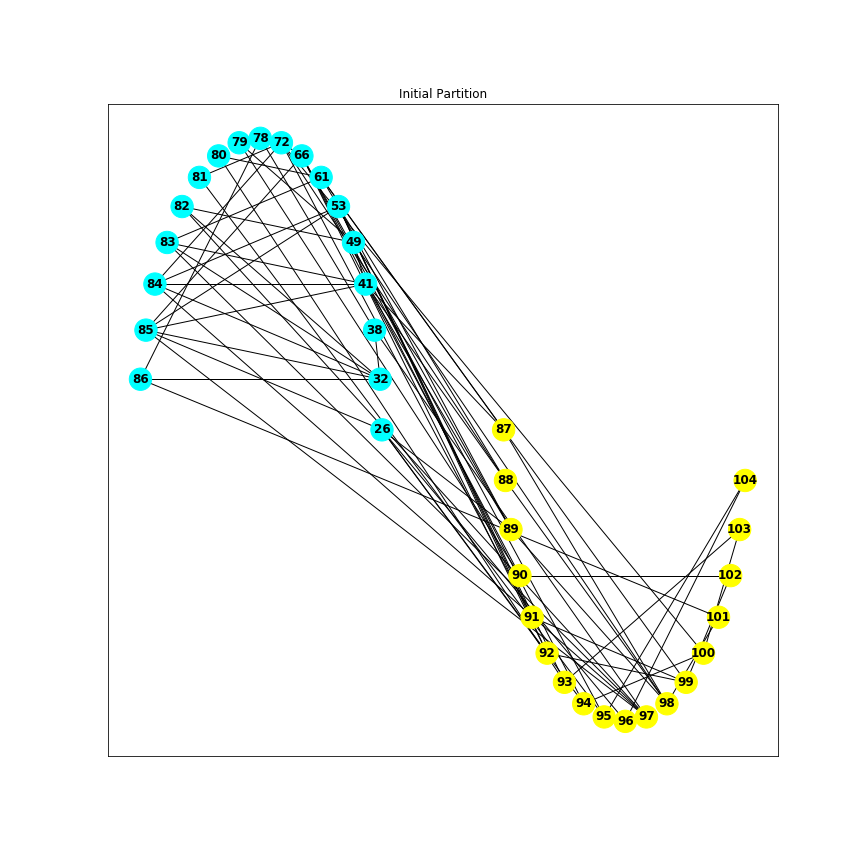
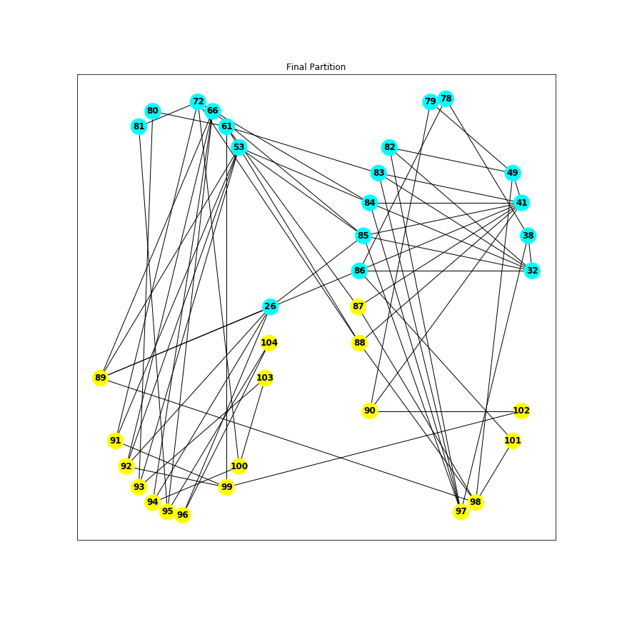
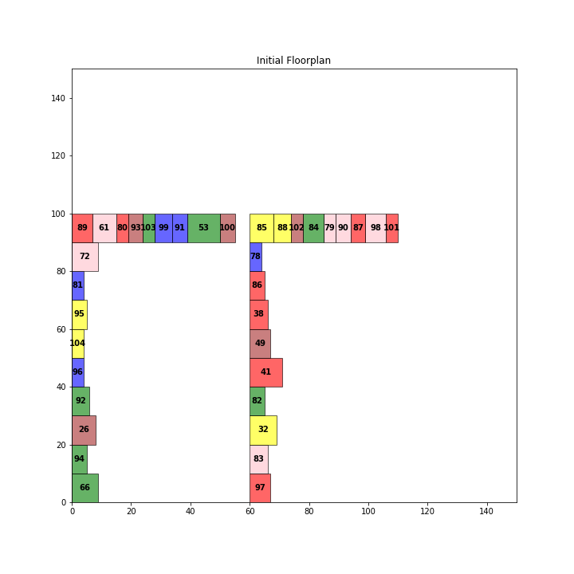
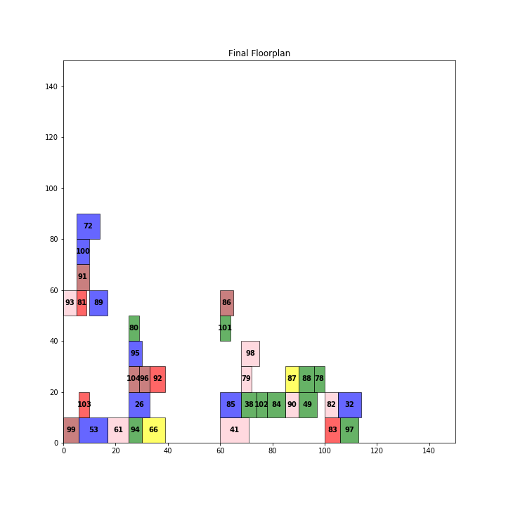

# VLSI Physical Design Tool

A simple tool built from scratch to demonstrate the physical design steps of VLSI Design Flow. The current version can successfully implement the steps of bi-partitioning and floorplanning. The placement and routing algorithms work decently well although some fixes are required for each of them, particularly the routing operation. This was done as a part of the course project of EC440: VLSI CAD at the National Institute of Technology, Karnataka. Refer to the [report](docs/Final_Report.pdf) for more details.

## Packages required
* networkx-->`pip install networkx`
* matplotlib
* numpy

## Parse 

The tool needs an ISCAS netlist as input. The parse and related programs create a networkx graph from the isc file. Run `parse.py` to get the graph. 

## Kernighan-Lin bi-partitioning

The Kernighan-Lin bi-partitioning algorithm is run on the input graph, and two optimal partitions are obtained. Run `partition.py` to get the partitions. The process is visualized below:

## Floorplan

The Simulated Annealing method is applied to get a good floorplan for the two partitions. Run `floorplan.py` to get the floorplans. The process is visualized below:

## Placement and Routing (in dev branch)

The Simulated Annealing heuristic and Lee's algorithm is applied for placement and routing respectively. However, the results are not that satisfactory as of now and the code needs many fixes. 
